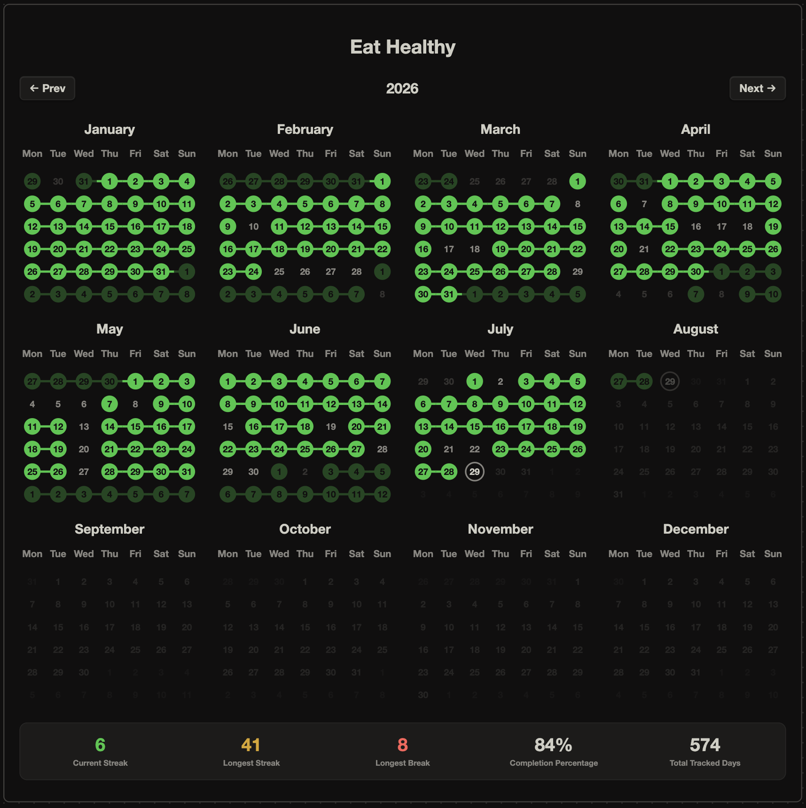
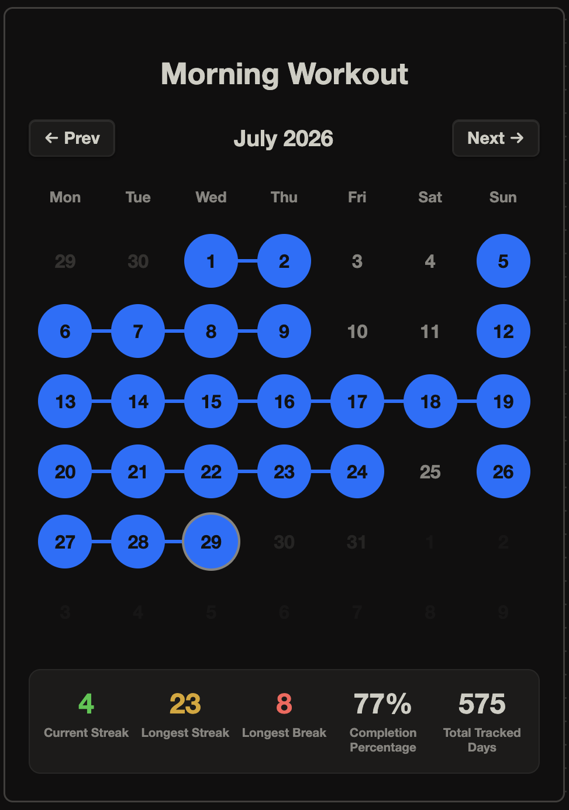
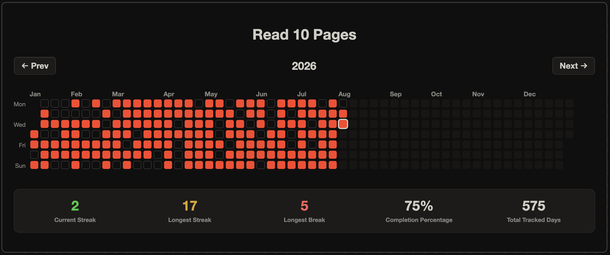

# Obsidian Habit Log

  
  

  

## Installation
1. Clone the repo, unzip.
2. Open [Obsidian](https://obsidian.md/), click **Open folder as vault**, and select the unzipped folder.
3. When prompted, click **"Trust author and enable plugins"**

>[!TIP]
**Porting to your own existing vault**
>
> - Copy and paste [habit-log](Scripts/habit-log.js) anywhere in your vault.
> - Install Dataview [^1]
> - Copy [habit-log.css](Scripts/habit-log.css) into your vault's `.obsidian/snippets` folder and enable it in `Settings > Appearance > CSS Snippets` [^2]
> - Copy over [Global config file](LogIndex.md) anywhere
> - Copy over the templates and make sure to use the right path for the scripts and the config file

## Logic
- Only positive entries are counted, `true` for boolean and `>0` values for numeric habits.
- No entry and `false` or `0` or `empty` entries mean the same. Given that, it is enough to log a habit only on the days it is a success.
- The `inverse: true` option displays the days that the habit was not logged, all stats are calculated accordingly. Useful if you want to log failure days alone for a habit.
- A tracking start date is required to differentiate failure days and untracked days which is important for calculating completion percentage and streaks and visual representation.

## Implementation

- Habits are tracked using the YAML frontmatter from daily notes. To log a habit, it has to be added as a property on that day's daily note. Clicking on a date in the tracker opens the corresponding daily note if it exists or creates one according to the [dailyNoteTemplate](Templates/dailyNoteTemplate.md).
- The tracker can be inserted anywhere with a `dataviewjs` code block. The template block with all the config options available is saved as [insertHabit](Templates/insertHabit.md) and [insertCombinedHabits](Templates/insertCombinedHabits.md) templates.
- The code block calls [habit-log](Scripts/habit-log.js) where everything is implemented including the rendering, so anything at all can be tweaked there.
- Global defaults for all habits can be centrally defined in [LogIndex](LogIndex.md). This is the default config file, but you can use any file by changing the configPath option in each code block.

## Example usage
> This is just a template and it is implemented in this vault for trying out

- Each tracker is saved as a note in the Cards folder and displayed in [Example Dashboard](Example%20Dashboard.canvas) for easily customizing a desired view.
- The habits that are tracked actively are added to the daily note template.
- Global configuration for all habits done in [LogIndex](LogIndex.md)
- Custom Hotkeys in this vault:
  - `^T` : insert template
  - `^D` : open daily note

[^1]: Dataview plugin required with 'Enable JavaScript queries' turned on.
[^2]: The [habit-log.css](Scripts/habit-log.css) snippet powers all visual rendering for both the individual and combined trackers, and also includes automatic layout tweaks for a cleaner display inside Obsidian Canvases.
